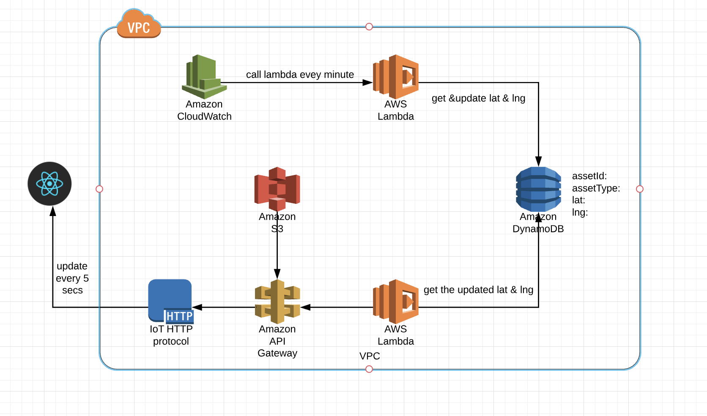
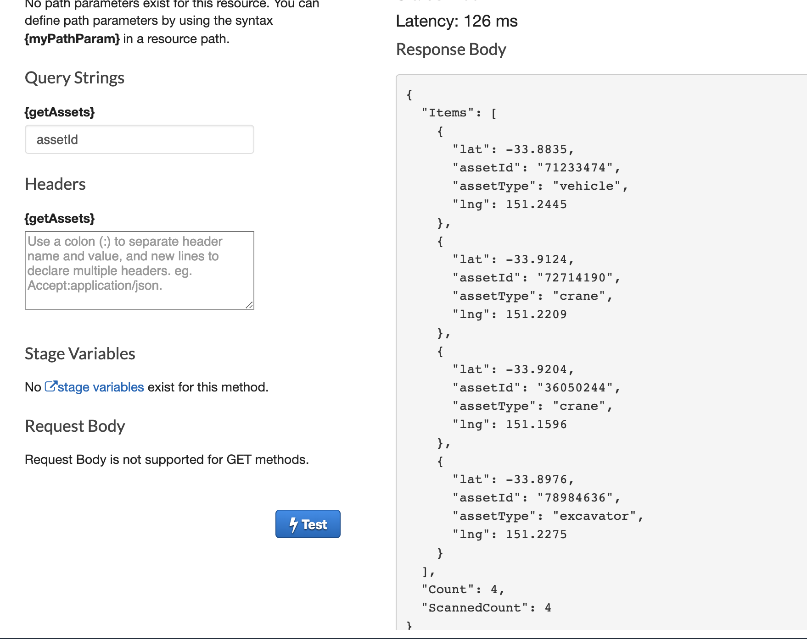
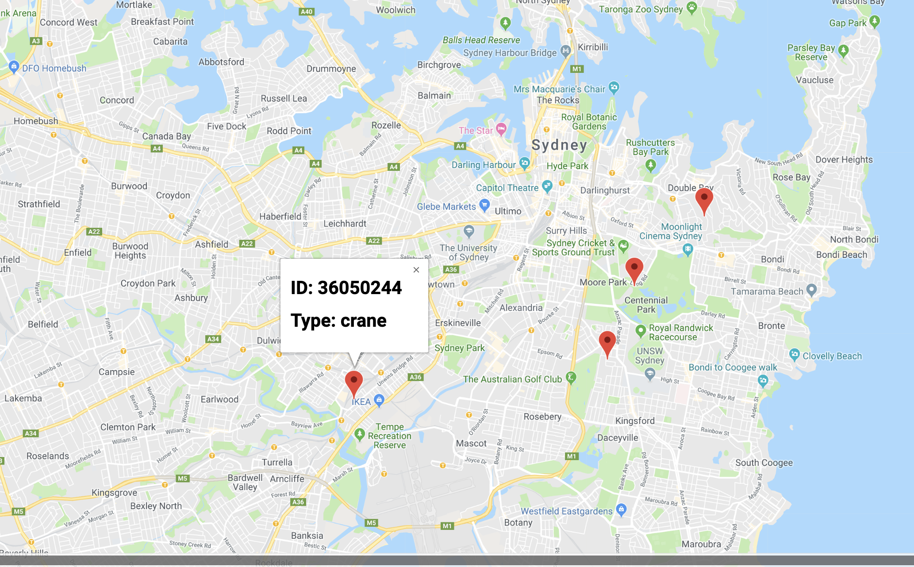

# GPS App
##Overview 
diagram

Vehicle Tracker Simulator: Lambda function that is triggered via CloudWatch Scheduled Event that saves a GPS coordinate into a DynamoDB table.

Backend: API Gateway/Lambda function that reads from the DynamoDB table and returns it to the frontend.

Frontend: A React-based component that plots the movement in a map.

## AWS


### Setup

1. Change the AWS region to us-east-1 N. Virgina, as the cloud watch service is avalible there. 
2. In cloud watch, set up an event rule: call the 'update assets data' lambda function every 1 min. 


### DynamoDB

1. Generate some initial json data with:

* random assetId;
* random AssetType;
* lat and lng such that they exist in Sydney CBD

e.g.

```
{
  "assetId": "36050244",
  "assetType": "crane",
  "lat": -33.9474,
  "lng": 151.2398
}
```

```
{
  "assetId": "71233474",
  "assetType": "vehicle",
  "lat": -33.9305,
  "lng": 151.2433
}
```

```
{
  "assetId": "72714190",
  "assetType": "crane",
  "lat": -33.9094,
  "lng": 151.253
}
```

```
{
  "assetId": "78984636",
  "assetType": "excavator",
  "lat": -33.9446,
  "lng": 151.2642
}
```

You can use the `scripts/generateNewAssets.js` script to generate random assets. 

`$ node scripts/generateNewAssets.js`

2. create a table named 'assets' with key: assetId, items: assetType, lat, lng


 Table name:assets


   | assetId         | AssetType           | lat      |  lng       |
   | -------------   |:-------------------:| -------: | -----:     |
   | 36050244        | crane               | -33.9204 | 151.1596   |
   | 71233474        | vehicle      		   | -33.8835 | 151.2445   |
   | 72714190        | crane               | -33.9124 | 151.2209   |
   | 78984636        | excavator           | -33.8976 | 151.2275   |


3. Populate the table with inital random data.

### Lambda

####  first lambda function: 

Name: getUpdateAssetsData

Rule: lambda-all-access (get permission to access DynamoDB)

Description: Keeps the initial assetId and AssetType constant, we don't want these to change because we don't want different vechicles poping up all the time. Update the Lat and Lng by adding 0.003 to simulate them moving.

#### second lambda function: 

Name: getAssets

Rule: lambda-all-access (get permission to access DynamoDB)

Description: get the current data from dynamoDB for data visualisation.

```javascript    
 docClient.scan(scanningParameters, function(err, data){
        if (err) {
            callback(err, null);
        } else {
            callback(null, data);
            data.Items.forEach(function(item) {
                updateAsset(item);
            });
        }
    });
```
### API gatway 

Create API gateway through "Add trigger" in the lambda function with name: getAssets

API methods are invoked by the front-end react app via HTTP,
 
"GET" method is used here to retreive the data from DynamoDB in JSON format.
 


###S3

Host a static website in a S3 bucket, so the website is accessible over the internet rather than just locally.

## Data visualization 
### React 

The React application starts by getting data via AWS API gateway. This React application on the front-end makes a request to a HTTP endpoint that triggers a lambda. The lambda returns the data it has fetched from DynamoDB.

```javascript  
updateAssets = ()
 => {  
 axios.get('YOUR_AWS_API')
            .then(response => {
                console.log("Getting data ...\n", response.data);
                this.setState({assets: response.data});
                this.render()
            });
  };
``` 
API gateway works as a middleware talking with React application via HTTP, as well as trigging the lambda function to get the data from DynamoDB so that the React can achieve the real-time asset lat and lng. 
Here I set up HTTP calls every 5 seconds. We can see the four markers are shown on the google map with ID and Type.

 

You can build the react app by calling `cd react;yarn build` and copy the `react/build` directory into S3.

##Scripts 


## Future Improvements and Challenges

Some improvements I'd like to make in the future.

1. Update the assets location more frequently. Cloud watch only allows for an update every 1 minute, seeing the assets move in real time would be better. This could be achieved outside a simulation using AWS IoT Core with a real device attached to real assets.

2. I had met a few problems: 

* Hosting the stastic website into S3.
* In the react front-end, the four markers are not shown in the google map, I fixed it by learning how to pass an element into another element.
